<h2 align="center">Hello, I'm Lukas Smeds! 👋 </h2>

<h3 align = "center">I am an up-and-coming programmer from Sweden!  </h3>

## I am currently learning:
  - **Typescript, Javascript** with **React, Vite, Python FastAPI & SQLALchemey**
  - **Systemverilog, RISC-V architecture, Assembly & Hardware**
  - Cybersecurity & Computer Communication
 
## I am looking for internship opportunities!

<!--

-->

  
   

<!--

**LukasSmeds/LukasSmeds** is a ✨ _special_ ✨ repository because its `README.md` (this file) appears on your GitHub profile.

Here are some ideas to get you started:

- 🔭 I’m currently working on ...
- 🌱 I’m currently learning ...
- 👯 I’m looking to collaborate on ...
- 🤔 I’m looking for help with ...
- 💬 Ask me about ...
- 📫 How to reach me: ...
- 😄 Pronouns: ...
- ⚡ Fun fact: ...
-->
